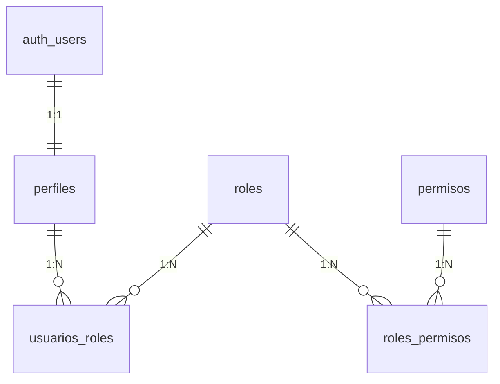
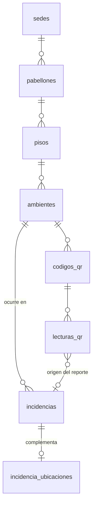
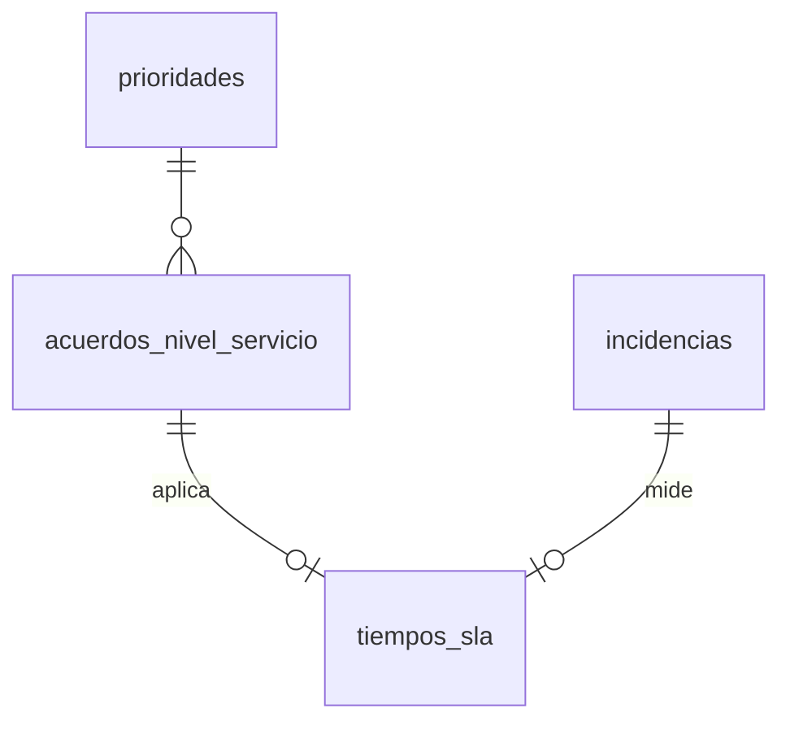

# 01 · DISEÑO DE BASE DE DATOS — SIR-UPSJB

**Proyecto:** SIR-UPSJB — Sistema Integral de Registro, Atención y Seguimiento de Incidencias
**Institución:** Universidad Privada San Juan Bautista — Filial Ica
**Motor:** PostgreSQL (Supabase)
**Estado del documento:** Modelo **APROBADO — Opción A (58 tablas literales del Plan Maestro)**. No incluye migraciones ejecutables, RLS, triggers definitivos ni funciones definitivas.

> Convención de marcado usada en todo el documento:
> `[P]` = decisión/valor propuesto por el equipo técnico (ajustable).
> `[VI]` = **pendiente de validación institucional** antes de implementarse como configuración oficial.

---

## Índice

1. Convenciones generales
2. Estrategias transversales (UUID, códigos, multi-sede, Storage, índices, borrado)
3. Modelo relacional por módulos (14 módulos, 58 tablas)
4. Decisión sobre las 58 tablas (Opción A aprobada)
5. Diagrama ER (Mermaid)
6. Diccionario de datos (detalle tabla por tabla)
7. Índices, UNIQUE y CHECK (listado consolidado)
8. Relaciones clave (roles, técnicos, equipos, historial, derivaciones, SLA)
9. Decisiones técnicas
10. Riesgos
11. Pendientes de validación institucional

---

## 1. Convenciones generales `[P]`

| Convención | Decisión |
|---|---|
| Identificadores | PK **UUID** (`uuid`) con `DEFAULT gen_random_uuid()` en todas las tablas. No se usan `serial`/`bigserial` como PK. |
| Nombres de tabla y columna | `snake_case`, en **español** (alineado al Plan Maestro). |
| Fechas y horas | `timestamptz` siempre (PostgreSQL almacena UTC; la conversión a hora de Ica —`America/Lima`— es responsabilidad de la aplicación para mostrar). |
| Booleanos | `boolean` con `DEFAULT false` o `true` explícito. |
| Textos | `text` (no `varchar(n)` salvo que el límite sea una regla de negocio; se usa `CHECK (char_length(x) <= n)` cuando aplique). |
| Catálogos | Tablas propias (no tipos `ENUM` de PostgreSQL): el administrador debe poder agregar/editar valores (Regla 10 del Plan Maestro). |
| Soft delete | Solo donde el Plan Maestro lo exige (usuarios, ambientes, equipos): columna `estado` + `activo boolean`, **no** borrado físico. |
| Auditoría de filas | `creado_en timestamptz NOT NULL DEFAULT now()` y `actualizado_en timestamptz NOT NULL DEFAULT now()` (mantenido por trigger genérico; el trigger se define en la fase de migraciones). |
| Autor de acciones | Columnas `xxx_por uuid` (FK → `auth.users.id`) o `registrado_por`; **nunca** texto libre. |
| Esquema | Todo en `public`. Sin esquemas adicionales por módulo (simplicidad; RLS se encarga del control). |
| Intercolección | Sin camelCase ni acentos ni ñ en identificadores SQL. |

### Convención de nombres de restricciones e índices `[P]`

- PK: `pk_<tabla>` — FK: `fk_<tabla>_<referencia>` — UNIQUE: `uq_<tabla>_<campo(s)>`
- CHECK: `ck_<tabla>_<campo>` — Índice: `idx_<tabla>_<campo(s)>`

---

## 2. Estrategias transversales

### 2.1 UUID `[P]`

- Todas las PK: `uuid DEFAULT gen_random_uuid()` (disponible en Supabase vía `pgcrypto`/núcleo, sin extensión adicional).
- Las tablas que se alinean con `auth.users` usan el **mismo UUID** de Supabase Auth como PK local (ver §3.1), evitando un mapeo extra y simplificando RLS.
- No se exponen UUID en URLs públicas cuando exista un código de negocio alternativo (p. ej. seguimiento de incidencias usa el código `INC-…`, no el UUID).

### 2.2 Código único de incidencia (Regla 1) `[P]`

- Formato: `INC-<AAAA>-<NNNNNN>` → `INC-2026-000128`.
- **Secuencia PostgreSQL anual**: `incidencias_codigo_seq`, consumida con `nextval()` dentro de la misma sentencia `INSERT` (atómico, sin colisiones por concurrencia; **nunca** `SELECT max()+1`).
- El número es correlativo global anual, no por sede (los códigos de sede van en el ambiente, no en el ticket; evita colisiones al sumar sedes).
- Columna `codigo text NOT NULL UNIQUE`, generada en el `INSERT` por función SQL (definitiva en fase de migraciones). Si el año cambia, una función de reset/recreación de secuencia anual se ejecuta programáticamente (o la secuencia se recrea por migración anual).
- El estado inicial (`PENDIENTE`) y fechas (`fecha_reporte = now()`) se establecen por `DEFAULT`, no por el cliente.

### 2.3 Código QR `[P]`

- Formato del código: `<SEDE>-<PABELLON>-<AMBIENTE>-<N>` → `ICA-B-B104-0001`.
- Columna `codigos_qr.codigo text NOT NULL UNIQUE` + `UNIQUE(ambiente_id)` parcial (`WHERE activo = true`): **un único QR activo por ambiente** (Regla 9).
- El contenido impreso del QR es una **URL estable de aplicación**: `https://<dominio>/r/<codigo>` (ruta de redirección). La URL nunca incluye el UUID.
- Riesgo cubierto: si cambia el dominio institucional, se reconfigura la ruta `/r/…` **sin regenerar ni reimprimir los QR**.
- `version int` permite regenerar el código (nuevo token) manteniendo el histórico; el QR anterior queda `activo = false` y `deshabilitado_en`.

### 2.4 Multi-sede `[P]`

- Jerarquía obligatoria: `sedes → pabellones → pisos → ambientes`. Toda FK de ubicación apunta a `ambientes`, nunca directamente a pabellón/sede (una sola fuente de verdad de "dónde").
- `sedes` con `activa boolean`: las sedes futuras (Chincha, Chorrillos, San Borja) se **habilitan por configuración**, no por cambios de esquema.
- Códigos (QR, ambiente) incluyen prefijo de sede (`ICA-…`).
- Los datos operativos (incidencias, técnicos, áreas) llevan el alcance por el ambiente o por FK explícita; ninguna tabla de negocio repite el nombre de sede.
- El coordinador queda acotado por sede/área vía `tecnicos.sede_id` / asignación (el recorte en consultas se hará con RLS en la fase correspondiente).

### 2.5 Archivos en Supabase Storage `[P]`

- **Un bucket privado único**: `evidencias` (privado; acceso mediante **signed URLs** de corta duración generadas en servidor).
- Convención de objeto (path): `<sede>/<año>/<incidencia_id>/<tipo>/<uuid>.<ext>` → `ica/2026/<incidencia_id>/antes/<uuid>.jpg`.
  - `tipo ∈ {antes, durante, despues, documento}` — controlado por `incidencia_adjuntos.tipo`.
- La BD guarda **solo la referencia** (bucket + path + metadatos), nunca bytes.
- Validación de subida (migraciones de storage, fase posterior): MIME permitido (`image/jpeg`, `image/png`, `image/webp`, `application/pdf`, `video/mp4`), tamaño máximo `[VI]` (propuesto: 10 MB), path exigido con el `incidencia_id` del usuario autorizado.
- Tabla de control: `incidencia_adjuntos` (§3.6.3).

### 2.6 Estrategia de índices `[P]`

- FK: índice en toda columna FK usada en filtros/joins (listado completo en §7).
- Consultas frecuentes: `incidencias(estado_id, sede vía ambiente)`, `incidencias(usuario_reportante_id, fecha_reporte desc)`, `incidencia_asignaciones(tecnico_id, activo)`, `incidencia_historial(incidencia_id, creado_en)`.
- `codigos_qr.codigo` y `incidencias.codigo` son `UNIQUE` (índice implícito); para el seguimiento público se usa además índice sobre `upper(incidencias.codigo)` para búsquedas case-insensitive.
- Catálogos pequeños (< 100 filas): sin índices adicionales.

### 2.7 Estrategia de borrado / ON DELETE `[P]`

Regla general: **nada se borra físicamente en el dominio operativo** (trazabilidad y auditoría). Política por tipo de relación:

| Tipo de relación | ON DELETE | Ejemplo |
|---|---|---|
| Catálogo maestro referenciado por datos operativos | `RESTRICT` | `prioridades`, `estados_incidencia`, `tipos_incidencia`, `sedes` |
| Detalle que muere con su dueño | `CASCADE` | `incidencia_adjuntos`, `incidencia_comentarios`, `incidencia_historial` (si alguna vez se borra la incidencia, lo cual queda bloqueado por la regla general) |
| Vinculación N:M | `CASCADE` | `usuarios_roles`, `tecnicos_especialidades`, `equipos_ambientes` |
| Registro histórico con dueño opcional | `SET NULL` | `movimientos_equipos.ambiente_destino_id` si se elimina un ambiente |
| `ON UPDATE` | Siempre `CASCADE` | Los PK UUID no cambian, pero se declara por uniformidad en claves naturales como códigos |

Complemento: columnas `activo`/`estado` para desactivar en lugar de borrar (usuarios, ambientes, equipos, QR, técnicos).

---

## 3. Modelo relacional por módulos

Visión estructural de los 14 módulos. El detalle campo por campo está en §6 (diccionario de datos).

### 3.1 M1 · Usuarios y seguridad (5 tablas)

| Tabla | Propósito | Relaciones clave |
|---|---|---|
| `perfiles` | Datos del usuario (1:1 con `auth.users` de Supabase; **PK = mismo UUID** de Supabase Auth) | 1:1 `auth.users` · 1:N hacia `incidencias` (como reportante) |
| `roles` | Catálogo de roles | N:M con `perfiles` vía `usuarios_roles` · N:M con `permisos` vía `roles_permisos` |
| `permisos` | Catálogo de permisos atómicos (`crear_incidencia`, `asignar_incidencia`, …) | N:M con `roles` |
| `roles_permisos` | Junction roles↔permisos | PK compuesta `(rol_id, permiso_id)` |
| `usuarios_roles` | Junction perfil↔roles (roles múltiples permitidos) | PK compuesta `(perfil_id, rol_id)` |

Cardinalidades: `perfiles 1—N usuarios_roles N—1 roles`; `roles 1—N roles_permisos N—1 permisos`.

### 3.2 M2 · Infraestructura (8 tablas)

| Tabla | Propósito | Relaciones clave |
|---|---|---|
| `sedes` | Sedes/filiales (Ica activa; resto habilitable) | 1:N `pabellones` |
| `pabellones` | Edificios por sede | N:1 `sedes` · 1:N `pisos` |
| `pisos` | Niveles del pabellón | N:1 `pabellones` · 1:N `ambientes` |
| `tipos_ambiente` | Catálogo (aula, laboratorio, oficina, …) | 1:N `ambientes` |
| `ambientes` | Todo espacio físico reportable | N:1 `pisos` · N:1 `tipos_ambiente` · 1:0..1 `aulas`/`laboratorios` · 1:1 `ambientes_caracteristicas` · 1:N `codigos_qr`, `equipos`, `incidencias` |
| `aulas` | Especialización de aula (1:1) | FK UNIQUE `ambiente_id` |
| `laboratorios` | Especialización de laboratorio (1:1) | FK UNIQUE `ambiente_id` |
| `ambientes_caracteristicas` | Atributos del ambiente (capacidad, proyector, …) | FK UNIQUE `ambiente_id` (1:0..1) |

Jerarquía obligatoria: `sedes → pabellones → pisos → ambientes` (multi-sede §2.4).

### 3.3 M3 · Equipos (7 tablas)

| Tabla | Propósito | Relaciones clave |
|---|---|---|
| `categorias_equipos` | Catálogo (computadora, monitor, proyector, …) | 1:N `equipos` |
| `marcas_equipos` | Fabricantes | 1:N `modelos_equipos` |
| `modelos_equipos` | Modelos por marca | N:1 `marcas_equipos` · 1:N `equipos` |
| `estados_equipos` | Catálogo (operativo, dañado, baja, …) | 1:N `equipos` |
| `equipos` | Activo individual (código interno, serie) | N:1 `categorias/modelos/estados` · 1:N `equipos_ambientes`, `incidencia_equipos`, `movimientos_equipos` |
| `equipos_ambientes` | Asignación vigente equipo↔ambiente (ubicación actual) | N:1 `equipos` · N:1 `ambientes` |
| `movimientos_equipos` | Historial de movimientos entre ambientes | N:1 `equipos` · N:0..1 `ambientes` (origen) · N:1 `ambientes` (destino) |

### 3.4 M4 · QR (2 tablas)

| Tabla | Propósito | Relaciones clave |
|---|---|---|
| `codigos_qr` | QR por ambiente (1 activo por ambiente, Regla 9) | N:1 `ambientes` · 1:N `lecturas_qr` |
| `lecturas_qr` | Registro de escaneos (usuario, dispositivo, navegador) | N:1 `codigos_qr` · N:0..1 `perfiles` (escaneo autenticado o anónimo) |

### 3.5 M5 · Incidencias (6 tablas)

| Tabla | Propósito | Relaciones clave |
|---|---|---|
| `tipos_incidencia` | Catálogo (técnica, infraestructura, …) | 1:N `subtipos_incidencia`, `incidencias` |
| `subtipos_incidencia` | Catálogo dependiente del tipo | N:1 `tipos_incidencia` · 1:N `incidencias` |
| `prioridades` | Catálogo (baja, media, alta, crítica) | 1:N `incidencias` · 1:N `acuerdos_nivel_servicio` |
| `estados_incidencia` | Catálogo de estado (pendiente → cerrada) | 1:N `incidencias` |
| `canales_reporte` | Catálogo (QR, web, administrador, …) | 1:N `incidencias` |
| `incidencias` | **Tabla principal** | N:1 reportante/tipo/subtipo/prioridad/estado/canal/ambiente · 1:N todo el módulo de detalle |

### 3.6 M6 · Detalle de incidencias (7 tablas)

| Tabla | Propósito | Relaciones clave |
|---|---|---|
| `incidencia_ubicaciones` | Complemento de ubicación específica (1:0..1) | N:0..1 `incidencias` (UNIQUE) |
| `incidencia_equipos` | N:M incidencia↔equipo (con `es_equipo_principal`) | N:1 `incidencias` · N:1 `equipos` |
| `incidencia_adjuntos` | Referencias a Storage (§2.5) | N:1 `incidencias` · N:1 `perfiles` (quien sube) |
| `incidencia_comentarios` | Conversación entre participantes | N:1 `incidencias` · N:1 `perfiles` (autor) |
| `incidencia_historial` | Cambios de estado/campo (Regla 4) | N:1 `incidencias` · N:1 `perfiles` (actor) |
| `incidencia_asignaciones` | Técnicos responsables (activa/histórica) | N:1 `incidencias` · N:1 `tecnicos` |
| `incidencia_derivaciones` | Transferencias entre áreas | N:1 `incidencias` · N:1 `areas` (origen/destino) |

### 3.7 M7 · Organización (7 tablas)

| Tabla | Propósito | Relaciones clave |
|---|---|---|
| `areas` | Áreas responsables `[VI]` lista oficial | 1:N `servicios`, `tecnicos`, `incidencia_derivaciones`, `reglas_enrutamiento` |
| `servicios` | Servicios por área | N:1 `areas` |
| `tecnicos` | Personal de atención (1:1 con perfil) | N:1 `perfiles` (UNIQUE) · N:1 `areas` · N:1 `sedes` |
| `especialidades_tecnicas` | Catálogo (soporte, redes, …) | N:M con `tecnicos` |
| `tecnicos_especialidades` | Junction | PK compuesta |
| `turnos` | Horarios de atención | N:M con `tecnicos` |
| `tecnicos_turnos` | Junction | PK compuesta |

### 3.8 M8 · Reglas de derivación (1 tabla)

| Tabla | Propósito | Relaciones clave |
|---|---|---|
| `reglas_enrutamiento` | Si tipo(+subtipo) → área(+servicio); prioridad de evaluación | N:1 `tipos_incidencia` · N:0..1 `subtipos_incidencia` · N:1 `areas` · N:0..1 `servicios` |

### 3.9 M9 · SLA (3 tablas)

| Tabla | Propósito | Relaciones clave |
|---|---|---|
| `acuerdos_nivel_servicio` | SLA por prioridad (+opcional tipo) | N:1 `prioridades` · N:0..1 `tipos_incidencia` |
| `tiempos_sla` | Registro de tiempos reales por incidencia | N:0..1 `incidencias` (UNIQUE) |
| `feriados` | Días no laborables para el cálculo hábil | Independiente |

### 3.10 M10 · Notificaciones (4 tablas)

| Tabla | Propósito | Relaciones clave |
|---|---|---|
| `notificaciones` | Notificaciones internas por usuario | N:1 `perfiles` · N:0..1 `incidencias` |
| `plantillas_notificacion` | Plantillas por tipo de evento | 1:N `notificaciones` |
| `preferencias_notificacion` | Qué recibe cada usuario (UNIQUE por perfil+evento) | N:1 `perfiles` |
| `dispositivos_usuario` | Preparación push futuro | N:1 `perfiles` |

### 3.11 M11 · Satisfacción (2 tablas)

| Tabla | Propósito | Relaciones clave |
|---|---|---|
| `encuestas_cierre` | Encuesta emitida al cierre (token único) | N:1 `incidencias` (UNIQUE) |
| `respuestas_encuesta` | Respuesta del usuario | 1:1 `encuestas_cierre` |

### 3.12 M12 · Base de conocimiento (2 tablas)

| Tabla | Propósito | Relaciones clave |
|---|---|---|
| `categorias_conocimiento` | Clasificación de artículos | 1:N `articulos_conocimiento` |
| `articulos_conocimiento` | Artículos de autoayuda | N:0..1 `tipos_incidencia` (vinculación opcional) |

### 3.13 M13 · Auditoría (2 tablas)

| Tabla | Propósito | Relaciones clave |
|---|---|---|
| `sesiones_usuario` | Registro de accesos (login/logout) como auditoría | N:1 `perfiles` |
| `registros_auditoria` | Acciones importantes (antes/después); **solo INSERT** desde BD | N:0..1 `perfiles` (actor) |

### 3.14 M14 · Reportes (2 tablas)

| Tabla | Propósito | Relaciones clave |
|---|---|---|
| `reportes_generados` | Reportes solicitados (parámetros, quien, cuándo) | N:1 `perfiles` |
| `exportaciones` | Archivos exportados (PDF/Excel/CSV) con ruta en Storage | N:1 `reportes_generados` |

---

## 4. Decisión sobre las 58 tablas — APROBADA: Opción A

El Plan Maestro (§10) autorizaba ajustar el modelo si alguna relación podía resolverse de manera más correcta con una tabla existente. Se evaluaron 3 simplificaciones:

- **S1**: fusionar `incidencia_ubicaciones` en `incidencias` — **descartada**.
- **S2**: fusionar `equipos_ambientes` con `movimientos_equipos` — **descartada**.
- **S3**: delimitar `sesiones_usuario` a registro de accesos (sin gestión de sesiones reales, que corresponde a Supabase Auth) — **aplicada como nota de alcance**, sin cambio estructural.

**Decisión del usuario: Opción A — las 58 tablas literales del Plan Maestro.** Consecuencias en el modelo:

| Tabla | Rol en la Opción A |
|---|---|
| `incidencia_ubicaciones` (29) | Complemento de ubicación específica de la incidencia (1:0..1); la ubicación principal (`ambiente_id`) vive en `incidencias` |
| `equipos_ambientes` (19) | Asignación vigente equipo↔ambiente: fuente de la **ubicación actual** del equipo |
| `movimientos_equipos` (20) | Historial de movimientos entre ambientes (trazabilidad) |
| `sesiones_usuario` (55) | Auditoría de accesos (login / logout / login fallido) |

**Resultado: 58 tablas físicas.**

---

## 5. Diagrama ER (Mermaid)

Diagrama completo de las 58 tablas (Opción A). Se muestran los campos clave; el detalle completo está en §6. `auth.users` es una tabla externa de Supabase (no se crea en nuestro esquema).

```mermaid
erDiagram
    %% ===== M1 Usuarios y seguridad =====
    auth_users ||--|| perfiles : "1:1 (mismo UUID)"
    perfiles ||--o{ usuarios_roles : "tiene"
    roles ||--o{ usuarios_roles : "asignado a"
    roles ||--o{ roles_permisos : "agrupa"
    permisos ||--o{ roles_permisos : "concede"

    %% ===== M2 Infraestructura =====
    sedes ||--o{ pabellones : "contiene"
    pabellones ||--o{ pisos : "contiene"
    pisos ||--o{ ambientes : "contiene"
    tipos_ambiente ||--o{ ambientes : "clasifica"
    ambientes ||--o| aulas : "especializa"
    ambientes ||--o| laboratorios : "especializa"
    ambientes ||--o| ambientes_caracteristicas : "describe"

    %% ===== M3 Equipos =====
    categorias_equipos ||--o{ equipos : "clasifica"
    marcas_equipos ||--o{ modelos_equipos : "define"
    modelos_equipos ||--o{ equipos : "instancia"
    estados_equipos ||--o{ equipos : "estado"
    equipos ||--o{ equipos_ambientes : "asignado a"
    ambientes ||--o{ equipos_ambientes : "aloja"
    equipos ||--o{ movimientos_equipos : "historial"
    ambientes ||--o{ movimientos_equipos : "origen/destino"

    %% ===== M4 QR =====
    ambientes ||--o{ codigos_qr : "identifica"
    codigos_qr ||--o{ lecturas_qr : "registra"
    perfiles |o--o{ lecturas_qr : "escanea"

    %% ===== M5 Incidencias =====
    perfiles ||--o{ incidencias : "reporta"
    ambientes ||--o{ incidencias : "ocurre en"
    tipos_incidencia ||--o{ subtipos_incidencia : "desglosa"
    tipos_incidencia ||--o{ incidencias : "clasifica"
    subtipos_incidencia |o--o{ incidencias : "detalla"
    prioridades ||--o{ incidencias : "prioriza"
    estados_incidencia ||--o{ incidencias : "estado"
    canales_reporte ||--o{ incidencias : "canal"

    %% ===== M6 Detalle =====
    incidencias ||--o| incidencia_ubicaciones : "complementa"
    incidencias ||--o{ incidencia_equipos : "vincula"
    equipos ||--o{ incidencia_equipos : "afectado"
    incidencias ||--o{ incidencia_adjuntos : "evidencia"
    perfiles ||--o{ incidencia_adjuntos : "sube"
    incidencias ||--o{ incidencia_comentarios : "comenta"
    perfiles ||--o{ incidencia_comentarios : "autor"
    incidencias ||--o{ incidencia_historial : "traza"
    perfiles ||--o{ incidencia_historial : "actor"
    incidencias ||--o{ incidencia_asignaciones : "asignada"
    tecnicos ||--o{ incidencia_asignaciones : "atiende"
    incidencias ||--o{ incidencia_derivaciones : "derivada"
    areas ||--o{ incidencia_derivaciones : "origen/destino"

    %% ===== M7 Organizacion =====
    areas ||--o{ servicios : "ofrece"
    areas ||--o{ tecnicos : "emplea"
    perfiles ||--o| tecnicos : "1:0..1"
    sedes ||--o{ tecnicos : "destaca"
    tecnicos ||--o{ tecnicos_especialidades : "posee"
    especialidades_tecnicas ||--o{ tecnicos_especialidades : "definida"
    tecnicos ||--o{ tecnicos_turnos : "cubiertos"
    turnos ||--o{ tecnicos_turnos : "programa"

    %% ===== M8 Reglas =====
    tipos_incidencia ||--o{ reglas_enrutamiento : "dispara"
    subtipos_incidencia |o--o{ reglas_enrutamiento : "refina"
    areas ||--o{ reglas_enrutamiento : "destino"
    servicios |o--o{ reglas_enrutamiento : "servicio"

    %% ===== M9 SLA =====
    prioridades ||--o{ acuerdos_nivel_servicio : "define"
    tipos_incidencia |o--o{ acuerdos_nivel_servicio : "matiza"
    incidencias ||--o| tiempos_sla : "mide"

    %% ===== M10 Notificaciones =====
    perfiles ||--o{ notificaciones : "recibe"
    incidencias |o--o{ notificaciones : "motiva"
    plantillas_notificacion |o--o{ notificaciones : "usa"
    perfiles ||--o{ preferencias_notificacion : "configura"
    perfiles ||--o{ dispositivos_usuario : "registra"

    %% ===== M11 Satisfaccion =====
    incidencias ||--o| encuestas_cierre : "evalua"
    encuestas_cierre ||--o| respuestas_encuesta : "responde"

    %% ===== M12 Conocimiento =====
    categorias_conocimiento ||--o{ articulos_conocimiento : "organiza"
    tipos_incidencia |o--o{ articulos_conocimiento : "relaciona"

    %% ===== M13 Auditoria =====
    perfiles ||--o{ sesiones_usuario : "inicia"
    perfiles |o--o{ registros_auditoria : "actor"

    %% ===== M14 Reportes =====
    perfiles ||--o{ reportes_generados : "solicita"
    reportes_generados ||--o{ exportaciones : "produce"
```

---

## 6. Diccionario de datos

Detalle tabla por tabla (Opción A, 58 tablas). Abreviaturas: **PK** primaria · **FK** foránea · **UQ** única · **CK** check · **DEF** default. Las marcas `[P]`/`[VI]` señalan valores propuestos o a validar.

### 6.1 M1 · Usuarios y seguridad

#### `perfiles` — datos del usuario
> PK = mismo UUID de `auth.users` (estrategia §2.1). Fila creada al registrarse (fase de autenticación).

| Campo | Tipo | Restricciones | Descripción |
|---|---|---|---|
| id | uuid | **PK**, DEF `gen_random_uuid()` | = `auth.users.id` |
| nombres | text | NOT NULL | Nombres |
| apellido_paterno | text | NOT NULL | Apellido paterno |
| apellido_materno | text | NULL | Apellido materno |
| documento | text | NULL, **UQ** (parcial `WHERE documento IS NOT NULL`) | DNI/documento |
| correo | citext | NOT NULL, **UQ** | Correo (citext = case-insensitive; alternativo: `text` + índice `lower()`) |
| telefono | text | NULL | Teléfono |
| codigo_usuario | text | NULL, **UQ** | Código institucional (alumno/worker) `[VI]` |
| estado | text | NOT NULL, DEF `'activo'`, **CK** `IN ('activo','suspendido')` | Estado de cuenta |
| creado_en / actualizado_en | timestamptz | NOT NULL, DEF `now()` | Auditoría de fila |

Índices: `uq` correo, `uq` documento, `idx_perfiles_estado`.

#### `roles` — catálogo de roles

| Campo | Tipo | Restricciones | Descripción |
|---|---|---|---|
| id | uuid | **PK** | |
| nombre | text | NOT NULL, **UQ** | `ADMINISTRADOR`, `COORDINADOR`, `TECNICO`, `DOCENTE`, `ESTUDIANTE`, `ADMINISTRATIVO`, `SUPERVISOR` (semilla `[VI]`) |
| descripcion | text | NULL | |
| activo | boolean | NOT NULL, DEF `true` | |
| creado_en / actualizado_en | timestamptz | NOT NULL, DEF `now()` | |

#### `permisos` — catálogo de permisos

| Campo | Tipo | Restricciones | Descripción |
|---|---|---|---|
| id | uuid | **PK** | |
| codigo | text | NOT NULL, **UQ** | `crear_incidencia`, `asignar_incidencia`, `gestionar_usuarios`, … |
| descripcion | text | NULL | |
| creado_en | timestamptz | NOT NULL, DEF `now()` | |

#### `roles_permisos` — junction roles ↔ permisos

| Campo | Tipo | Restricciones |
|---|---|---|
| rol_id | uuid | **PK compuesta (rol_id, permiso_id)** · FK → `roles.id` ON DELETE CASCADE |
| permiso_id | uuid | **PK compuesta** · FK → `permisos.id` ON DELETE CASCADE |

#### `usuarios_roles` — junction perfil ↔ roles (roles múltiples)

| Campo | Tipo | Restricciones |
|---|---|---|
| perfil_id | uuid | **PK compuesta (perfil_id, rol_id)** · FK → `perfiles.id` ON DELETE CASCADE |
| rol_id | uuid | **PK compuesta** · FK → `roles.id` ON DELETE CASCADE |
| asignado_por | uuid | NULL, FK → `perfiles.id` ON DELETE SET NULL |
| asignado_en | timestamptz | NOT NULL, DEF `now()` |

### 6.2 M2 · Infraestructura

#### `sedes` — sedes/filiales (multi-sede §2.4)

| Campo | Tipo | Restricciones | Descripción |
|---|---|---|---|
| id | uuid | **PK** | |
| nombre | text | NOT NULL, **UQ** | "Filial Ica" |
| codigo | text | NOT NULL, **UQ**, **CK** `IN ('A-Z0-9-')` | `ICA` (prefijo de QR) |
| direccion | text | NULL | |
| activa | boolean | NOT NULL, DEF `false` | Solo Ica inicia `true` `[VI]` |
| creado_en / actualizado_en | timestamptz | NOT NULL, DEF `now()` | |

#### `pabellones` — edificios

| Campo | Tipo | Restricciones |
|---|---|---|
| id | uuid | **PK** |
| sede_id | uuid | NOT NULL, **FK** → `sedes` ON DELETE RESTRICT |
| nombre | text | NOT NULL |
| codigo | text | NOT NULL, **UQ (sede_id, codigo)** | `ICA-B` |
| activo | boolean | NOT NULL, DEF `true` |
| creado_en / actualizado_en | timestamptz | NOT NULL, DEF `now()` |

Índice: `idx_pabellones_sede`.

#### `pisos` — niveles

| Campo | Tipo | Restricciones |
|---|---|---|
| id | uuid | **PK** |
| pabellon_id | uuid | NOT NULL, **FK** → `pabellones` ON DELETE RESTRICT |
| numero | int | NOT NULL, **CK** `numero >= -2 AND numero <= 20` (soporta sótanos) |
| nombre | text | NULL | "Piso 1", "Nivel 2" |
| **UQ** | — | `(pabellon_id, numero)` |

Índice: `idx_pisos_pabellon`.

#### `tipos_ambiente` — catálogo

| Campo | Tipo | Restricciones |
|---|---|---|
| id | uuid | **PK** |
| nombre | text | NOT NULL, **UQ** | Aula, Laboratorio, Oficina, Auditorío, Biblioteca, Baño, Taller, Almacén, Otro |
| activo | boolean | NOT NULL, DEF `true` |

#### `ambientes` — todo espacio físico reportable

| Campo | Tipo | Restricciones | Descripción |
|---|---|---|---|
| id | uuid | **PK** | |
| piso_id | uuid | NOT NULL, **FK** → `pisos` ON DELETE RESTRICT | Jerarquía completa vía cadena de FK |
| tipo_ambiente_id | uuid | NOT NULL, **FK** → `tipos_ambiente` ON DELETE RESTRICT | |
| nombre | text | NOT NULL | "Aula B-104" |
| codigo | text | NOT NULL, **UQ** | `ICA-B-B104` (incluye sede, §2.4) |
| detalle_ubicacion | text | NULL | Referencia interna ("ala norte") |
| activo | boolean | NOT NULL, DEF `true` | Soft delete |
| creado_en / actualizado_en | timestamptz | NOT NULL, DEF `now()` | |

Índices: `idx_ambientes_piso`, `idx_ambientes_tipo`, `idx_ambientes_activo`.

#### `aulas` — especialización (1:0..1)

| Campo | Tipo | Restricciones |
|---|---|---|
| ambiente_id | uuid | **PK = FK** → `ambientes` ON DELETE CASCADE (patrón tabla-hija) |
| capacidad | int | NULL, **CK** `capacidad > 0` |
| tiene_computadoras | boolean | DEF `false` |

#### `laboratorios` — especialización (1:0..1)

| Campo | Tipo | Restricciones |
|---|---|---|
| ambiente_id | uuid | **PK = FK** → `ambientes` ON DELETE CASCADE |
| capacidad | int | NULL, **CK** `capacidad > 0` |
| tipo_laboratorio | text | NULL `[VI]` |

#### `ambientes_caracteristicas` — atributos (1:0..1)

| Campo | Tipo | Restricciones |
|---|---|---|
| ambiente_id | uuid | **PK = FK** → `ambientes` ON DELETE CASCADE |
| capacidad | int | NULL |
| proyector | boolean | DEF `false` |
| computadoras | int | DEF `0` |
| internet | boolean | DEF `true` |
| aire_acondicionado | boolean | DEF `false` |
| pizarra | boolean | DEF `true` |
| observaciones | text | NULL |

> Alternativa K-V (clave/valor) descartada: complica consultas y validaciones; los atributos son estables y finitos.

### 6.3 M3 · Equipos

#### `categorias_equipos`, `marcas_equipos`, `estados_equipos` — catálogos simples

Estructura común: `id uuid PK` · `nombre text NOT NULL UNIQUE` · `activo boolean DEF true`. `estados_equipos` añade `es_final boolean DEF false` (baja/fuera de servicio).

#### `modelos_equipos`

| Campo | Tipo | Restricciones |
|---|---|---|
| id | uuid | **PK** |
| marca_id | uuid | NOT NULL, **FK** → `marcas_equipos` ON DELETE RESTRICT |
| nombre | text | NOT NULL, **UQ (marca_id, nombre)** |

#### `equipos` — activo individual

| Campo | Tipo | Restricciones | Descripción |
|---|---|---|---|
| id | uuid | **PK** | |
| codigo_interno | text | NOT NULL, **UQ** | `[VI]` formato institucional |
| numero_serie | text | NULL, **UQ** (parcial) | |
| categoria_id | uuid | NOT NULL, **FK** → `categorias_equipos` ON DELETE RESTRICT |
| modelo_id | uuid | NULL, **FK** → `modelos_equipos` ON DELETE SET NULL |
| estado_id | uuid | NOT NULL, **FK** → `estados_equipos` ON DELETE RESTRICT |
| fecha_adquisicion | date | NULL | |
| garantia_hasta | date | NULL |
| observaciones | text | NULL |
| activo | boolean | NOT NULL, DEF `true` | Baja lógica |
| creado_en / actualizado_en | timestamptz | NOT NULL, DEF `now()` | |

Índices: `idx_equipos_estado`, `idx_equipos_categoria`, `idx_equipos_codigo_interno` (UQ implícito).

#### `equipos_ambientes` — asignación vigente equipo↔ambiente (ubicación actual)

| Campo | Tipo | Restricciones | Descripción |
|---|---|---|---|
| equipo_id | uuid | **PK compuesta (equipo_id, ambiente_id)** · FK → `equipos` ON DELETE CASCADE | |
| ambiente_id | uuid | **PK compuesta** · FK → `ambientes` ON DELETE RESTRICT | |
| activa | boolean | NOT NULL, DEF `true` | La reubicación cierra la asignación anterior |
| asignado_en | timestamptz | NOT NULL, DEF `now()` | |
| asignado_por | uuid | NULL, **FK** → `perfiles` ON DELETE SET NULL | |

**Índice parcial único** `uq_asignacion_equipo_activa ON (equipo_id) WHERE activa` — un equipo tiene a lo sumo **una asignación activa** (su ubicación actual). Índice: `idx_equipos_ambientes_ambiente`.

#### `movimientos_equipos` — historial de movimientos (trazabilidad)

| Campo | Tipo | Restricciones | Descripción |
|---|---|---|---|
| id | uuid | **PK** |
| equipo_id | uuid | NOT NULL, **FK** → `equipos` ON DELETE CASCADE |
| ambiente_origen_id | uuid | NULL, **FK** → `ambientes` ON DELETE SET NULL |
| ambiente_destino_id | uuid | NOT NULL, **FK** → `ambientes` ON DELETE RESTRICT |
| tipo_movimiento | text | NOT NULL, **CK** `IN ('asignacion','traslado','mantenimiento','baja')` |
| fecha_desde | timestamptz | NOT NULL, DEF `now()` |
| fecha_hasta | timestamptz | NULL | NULL = ubicación actual |
| registrado_por | uuid | NULL, **FK** → `perfiles` ON DELETE SET NULL |
| observaciones | text | NULL |

Índices: `idx_movimientos_equipos_equipo`, `idx_movimientos_equipos_destino`.

> Consistencia: la asignación activa de `equipos_ambientes` y la fila abierta de `movimientos_equipos` deben coincidir; se garantizará con trigger en la fase de migraciones.

### 6.4 M4 · QR

#### `codigos_qr` — un QR activo por ambiente (Regla 9)

| Campo | Tipo | Restricciones | Descripción |
|---|---|---|---|
| id | uuid | **PK** |
| ambiente_id | uuid | NOT NULL, **FK** → `ambientes` ON DELETE RESTRICT |
| codigo | text | NOT NULL, **UQ**, **CK** formato | `ICA-B-B104-0001` (§2.3) |
| url_destino | text | NOT NULL | `/r/<codigo>` (generada, no impresa por el usuario) |
| version | int | NOT NULL, DEF `1` | Regeneraciones |
| activo | boolean | NOT NULL, DEF `true` |
| **UQ parcial** | — | `UNIQUE(ambiente_id) WHERE activo` | Un solo QR activo por ambiente |
| generado_por | uuid | NULL, **FK** → `perfiles` ON DELETE SET NULL |
| generado_en | timestamptz | NOT NULL, DEF `now()` |
| deshabilitado_en | timestamptz | NULL |

Índices: `idx_codigos_qr_ambiente`, `idx_codigos_qr_activo`.

#### `lecturas_qr` — registro de escaneos

| Campo | Tipo | Restricciones | Descripción |
|---|---|---|---|
| id | uuid | **PK** |
| codigo_qr_id | uuid | NOT NULL, **FK** → `codigos_qr` ON DELETE CASCADE |
| perfil_id | uuid | NULL, **FK** → `perfiles` ON DELETE SET NULL | NULL = escaneo anónimo |
| dispositivo | text | NULL | User-agent resumido |
| navegador | text | NULL | |
| ip_hash | text | NULL | **Hash**, nunca IP en claro (Plan Maestro §14.2) |
| leido_en | timestamptz | NOT NULL, DEF `now()` |

Índices: `idx_lecturas_qr_codigo`, `idx_lecturas_qr_fecha`.

### 6.5 M5 · Incidencias

#### `tipos_incidencia` / `prioridades` / `estados_incidencia` / `canales_reporte` — catálogos

Estructura común: `id uuid PK` · `nombre text NOT NULL UNIQUE` · `activo boolean DEF true`.

- `tipos_incidencia`: Técnica, Infraestructura, Conectividad, Mobiliario, Limpieza, Seguridad, Académica, Administrativa, Otro `[VI]`.
- `prioridades`: añade `nivel int NOT NULL UNIQUE CHECK (nivel BETWEEN 1 AND 4)` (1=Baja … 4=Crítica — orden para SLA) y `color text` (para UI §50).
- `estados_incidencia`: añade `orden int NOT NULL UNIQUE` (secuencia del flujo), `es_final boolean DEF false` (Cerrada, Cancelada) y `color text`.
- `canales_reporte`: QR, Web, Administrador, Docente, Teléfono, Otro.

#### `subtipos_incidencia`

| Campo | Tipo | Restricciones |
|---|---|---|
| id | uuid | **PK** |
| tipo_incidencia_id | uuid | NOT NULL, **FK** → `tipos_incidencia` ON DELETE RESTRICT |
| nombre | text | NOT NULL, **UQ (tipo_incidencia_id, nombre)** | "Monitor sin señal", "Internet lento", … |
| activo | boolean | DEF `true` |

#### `incidencias` — tabla principal

| Campo | Tipo | Restricciones | Descripción |
|---|---|---|---|
| id | uuid | **PK** | |
| codigo | text | NOT NULL, **UQ** | `INC-2026-000128` (estrategia §2.2, secuencia anual) |
| usuario_reportante_id | uuid | NULL, **FK** → `perfiles` ON DELETE SET NULL | NULL = reporte anónimo `[VI]` (decisión §7.D) |
| ambiente_id | uuid | NOT NULL, **FK** → `ambientes` ON DELETE RESTRICT | Ubicación principal (del QR o del formulario) |
| tipo_incidencia_id | uuid | NOT NULL, **FK** → `tipos_incidencia` ON DELETE RESTRICT |
| subtipo_incidencia_id | uuid | NULL, **FK** → `subtipos_incidencia` ON DELETE SET NULL |
| **CK coherencia** | — | `CK (subtipo ∈ tipo)` | El subtipo debe pertenecer al tipo elegido (integridad referencial compuesta; detalle en §8) |
| prioridad_id | uuid | NOT NULL, **FK** → `prioridades` ON DELETE RESTRICT | DEF = prioridad Media `[P]` |
| estado_id | uuid | NOT NULL, **FK** → `estados_incidencia` ON DELETE RESTRICT | DEF = Pendiente |
| canal_reporte_id | uuid | NOT NULL, **FK** → `canales_reporte` ON DELETE RESTRICT | DEF = QR |
| descripcion | text | NOT NULL, **CK** `char_length(x) BETWEEN 10 AND 2000` |
| fecha_reporte | timestamptz | NOT NULL, DEF `now()` |
| fecha_asignacion | timestamptz | NULL |
| fecha_inicio | timestamptz | NULL | Inicio de atención |
| fecha_resolucion | timestamptz | NULL |
| fecha_cierre | timestamptz | NULL |
| cerrado_por | uuid | NULL, **FK** → `perfiles` ON DELETE SET NULL |
| creado_en / actualizado_en | timestamptz | NOT NULL, DEF `now()` | |

Índices: `idx_incidencias_estado`, `idx_incidencias_ambiente`, `idx_incidencias_reportante_fecha`, `idx_incidencias_tipo`, `idx_incidencias_prioridad`, `idx_incidencias_fecha_reporte`, `uq_incidencias_codigo` (implícito) + índice `upper(codigo)` para búsqueda case-insensitive.

> Nota: el área responsable y el técnico no viven en `incidencias`; viven en `incidencia_derivaciones` (destino actual) e `incidencia_asignaciones` (asignación activa). Evita duplicación y conserva el historial completo (§8).

### 6.6 M6 · Detalle de incidencias

#### `incidencia_ubicaciones` — complemento de ubicación específica (1:0..1)

| Campo | Tipo | Restricciones | Descripción |
|---|---|---|---|
| incidencia_id | uuid | **PK = FK** → `incidencias` ON DELETE CASCADE | Patrón tabla-hija (1:0..1) |
| referencia_adicional | text | NULL | "PC 12 del fondo", "junto a la ventana" |
| registrado_en | timestamptz | NOT NULL, DEF `now()` | |

> La ubicación principal (`ambiente_id`) vive en `incidencias`; esta tabla solo complementa el detalle cuando el usuario lo aporta (Plan Maestro §16.1).

#### `incidencia_equipos` — N:M incidencia ↔ equipo

| Campo | Tipo | Restricciones | Descripción |
|---|---|---|---|
| incidencia_id | uuid | **PK compuesta (incidencia_id, equipo_id)** · FK → `incidencias` ON DELETE CASCADE | |
| equipo_id | uuid | **PK compuesta** · FK → `equipos` ON DELETE RESTRICT | Regla 7: mantiene historial del equipo |
| es_equipo_principal | boolean | NOT NULL, DEF `false` | El equipo señalado como causa |
| detalle | text | NULL | "PC 12 — monitor" |

#### `incidencia_adjuntos` — referencias a Storage (§2.5)

| Campo | Tipo | Restricciones | Descripción |
|---|---|---|---|
| id | uuid | **PK** |
| incidencia_id | uuid | NOT NULL, **FK** → `incidencias` ON DELETE CASCADE | |
| subido_por | uuid | NULL, **FK** → `perfiles` ON DELETE SET NULL | |
| tipo | text | NOT NULL, **CK** `IN ('antes','durante','despues','documento','video')` | Etapa de la evidencia |
| bucket | text | NOT NULL, DEF `'evidencias'` | |
| path | text | NOT NULL, **UQ** | Ruta completa del objeto |
| nombre_archivo | text | NOT NULL | Nombre original |
| mime_type | text | NOT NULL |
| tamano_bytes | bigint | NULL, **CK** `tamano_bytes > 0` |
| creado_en | timestamptz | NOT NULL, DEF `now()` |

Índices: `idx_adjuntos_incidencia`, `idx_adjuntos_path` (UQ implícito).

#### `incidencia_comentarios` — conversación

| Campo | Tipo | Restricciones |
|---|---|---|
| id | uuid | **PK** |
| incidencia_id | uuid | NOT NULL, **FK** → `incidencias` ON DELETE CASCADE |
| autor_id | uuid | NULL, **FK** → `perfiles` ON DELETE SET NULL |
| comentario | text | NOT NULL, **CK** `char_length(x) BETWEEN 1 AND 3000` |
| es_interno | boolean | NOT NULL, DEF `false` | Nota interna (no visible al reportante) `[VI]` |
| creado_en | timestamptz | NOT NULL, DEF `now()` |

Índices: `idx_comentarios_incidencia`.

#### `incidencia_historial` — trazabilidad (Regla 4)
> Escritura **solo desde triggers/RPC** (fase de migraciones); el cliente nunca la modifica.

| Campo | Tipo | Restricciones | Descripción |
|---|---|---|---|
| id | uuid | **PK** |
| incidencia_id | uuid | NOT NULL, **FK** → `incidencias` ON DELETE CASCADE |
| actor_id | uuid | NULL, **FK** → `perfiles` ON DELETE SET NULL | NULL = sistema/automatización |
| tipo_cambio | text | NOT NULL, **CK** `IN ('estado','prioridad','asignacion','derivacion','edicion','cierre','cancelacion','otro')` |
| campo | text | NULL | Nombre de la columna cambiada |
| valor_anterior | text | NULL | Serializado como texto |
| valor_nuevo | text | NULL |
| detalle | text | NULL | Comentario del cambio |
| creado_en | timestamptz | NOT NULL, DEF `now()` |

Índices: `idx_historial_incidencia_fecha`.

#### `incidencia_asignaciones` — técnicos responsables

| Campo | Tipo | Restricciones | Descripción |
|---|---|---|---|
| id | uuid | **PK** |
| incidencia_id | uuid | NOT NULL, **FK** → `incidencias` ON DELETE CASCADE |
| tecnico_id | uuid | NOT NULL, **FK** → `tecnicos` ON DELETE RESTRICT |
| asignado_por | uuid | NULL, **FK** → `perfiles` ON DELETE SET NULL |
| activa | boolean | NOT NULL, DEF `true` | La reasignación cierra la anterior |
| asignado_en | timestamptz | NOT NULL, DEF `now()` |
| aceptado_en | timestamptz | NULL | El técnico acepta la incidencia |
| cerrada_en | timestamptz | NULL |

**Índice parcial único** `uq_asignacion_activa ON (incidencia_id) WHERE activa` — **a lo sumo un técnico activo por incidencia** (Regla del flujo §6; la reasignación cierra la fila anterior).
Índices: `idx_asignaciones_tecnico`, `idx_asignaciones_incidencia`.

#### `incidencia_derivaciones` — transferencias entre áreas

| Campo | Tipo | Restricciones | Descripción |
|---|---|---|---|
| id | uuid | **PK** |
| incidencia_id | uuid | NOT NULL, **FK** → `incidencias` ON DELETE CASCADE |
| area_origen_id | uuid | NULL, **FK** → `areas` ON DELETE SET NULL | NULL = sin área previa (derivación inicial) |
| area_destino_id | uuid | NOT NULL, **FK** → `areas` ON DELETE RESTRICT |
| servicio_destino_id | uuid | NULL, **FK** → `servicios` ON DELETE SET NULL |
| motivo | text | NOT NULL |
| **CK** | — | `area_origen_id IS NULL OR area_origen_id <> area_destino_id` | Prohibido auto-derivarse |
| activa | boolean | NOT NULL, DEF `true` | La siguiente derivación cierra la anterior |
| derivado_por | uuid | NULL, **FK** → `perfiles` ON DELETE SET NULL |
| derivado_en | timestamptz | NOT NULL, DEF `now()` |

**Índice parcial único** `uq_derivacion_activa ON (incidencia_id) WHERE activa` — el destino vigente es la fila abierta.
Índices: `idx_derivaciones_incidencia`, `idx_derivaciones_area_destino`.

### 6.7 M7 · Organización

#### `areas` — áreas responsables `[VI]` lista oficial

| Campo | Tipo | Restricciones |
|---|---|---|
| id | uuid | **PK** |
| nombre | text | NOT NULL, **UQ** | "Sistemas de Información", "Infraestructura y Servicios Generales", … |
| descripcion | text | NULL |
| correo | text | NULL | Buzón del área (fase de notificaciones) |
| activo | boolean | DEF `true` |
| creado_en / actualizado_en | timestamptz | NOT NULL, DEF `now()` |

#### `servicios` — servicios por área

| Campo | Tipo | Restricciones |
|---|---|---|
| id | uuid | **PK** |
| area_id | uuid | NOT NULL, **FK** → `areas` ON DELETE RESTRICT |
| nombre | text | NOT NULL, **UQ (area_id, nombre)** | "Redes", "Soporte de computadoras", … |
| activo | boolean | DEF `true` |

Índice: `idx_servicios_area`.

#### `tecnicos` — personal de atención (1:0..1 con perfil)

| Campo | Tipo | Restricciones |
|---|---|---|
| id | uuid | **PK** |
| perfil_id | uuid | NOT NULL, **UQ**, **FK** → `perfiles` ON DELETE CASCADE |
| area_id | uuid | NOT NULL, **FK** → `areas` ON DELETE RESTRICT |
| sede_id | uuid | NOT NULL, **FK** → `sedes` ON DELETE RESTRICT | Multi-sede: el técnico pertenece a una sede |
| codigo_tecnico | text | NULL, **UQ** | `[VI]` |
| carga_maxima | int | NOT NULL, DEF `10`, **CK** `BETWEEN 1 AND 100` | Límite de incidencias activas `[P]` |
| activo | boolean | DEF `true` |
| creado_en / actualizado_en | timestamptz | NOT NULL, DEF `now()` |

Índices: `idx_tecnicos_area`, `idx_tecnicos_sede`.

#### `especialidades_tecnicas` — catálogo
Estructura común: `id PK`, `nombre UNIQUE` (Soporte, Redes, Hardware, Software, Electricidad, …), `activo`.

#### `tecnicos_especialidades` — junction

| Campo | Tipo | Restricciones |
|---|---|---|
| tecnico_id | uuid | **PK compuesta (tecnico_id, especialidad_id)** · FK → `tecnicos` ON DELETE CASCADE |
| especialidad_id | uuid | **PK compuesta** · FK → `especialidades_tecnicas` ON DELETE RESTRICT |

#### `turnos` — horarios de atención `[VI]`

| Campo | Tipo | Restricciones |
|---|---|---|
| id | uuid | **PK** |
| nombre | text | NOT NULL, **UQ** | "Mañana", "Tarde", "Noche" |
| hora_inicio | time | NOT NULL |
| hora_fin | time | NOT NULL, **CK** `hora_fin > hora_inicio` |
| dias_semana | int[] | NOT NULL, DEF `'{1,2,3,4,5}'` | ISO: 1=lunes … 7=domingo |
| activo | boolean | DEF `true` |

#### `tecnicos_turnos` — junction

| Campo | Tipo | Restricciones |
|---|---|---|
| tecnico_id | uuid | **PK compuesta (tecnico_id, turno_id)** · FK → `tecnicos` ON DELETE CASCADE |
| turno_id | uuid | **PK compuesta** · FK → `turnos` ON DELETE CASCADE |
| desde | date | NOT NULL, DEF `CURRENT_DATE` | Vigencia del turno |
| hasta | date | NULL | NULL = vigente |

### 6.8 M8 · Reglas de derivación

#### `reglas_enrutamiento` — clasificación automática (Regla 10, configurable)

| Campo | Tipo | Restricciones | Descripción |
|---|---|---|---|
| id | uuid | **PK** |
| nombre | text | NOT NULL |
| tipo_incidencia_id | uuid | NOT NULL, **FK** → `tipos_incidencia` ON DELETE RESTRICT |
| subtipo_incidencia_id | uuid | NULL, **FK** → `subtipos_incidencia` ON DELETE CASCADE | NULL = regla para todo el tipo |
| area_destino_id | uuid | NOT NULL, **FK** → `areas` ON DELETE RESTRICT |
| servicio_destino_id | uuid | NULL, **FK** → `servicios` ON DELETE SET NULL |
| prioridad_defecto_id | uuid | NULL, **FK** → `prioridades` ON DELETE SET NULL |
| prioridad_orden | int | NOT NULL | Orden de evaluación (más específica primero) |
| activa | boolean | NOT NULL, DEF `true` |
| creado_en / actualizado_en | timestamptz | NOT NULL, DEF `now()` |

**UQ parcial** `uq_reglas_orden ON (prioridad_orden) WHERE activa` + **UQ** `(tipo_incidencia_id, COALESCE(subtipo_incidencia_id, '000…'))`: evita reglas duplicadas para el mismo alcance. Semántica: regla con subtipo tiene prioridad sobre la del tipo (resuelto por `prioridad_orden` en la consulta de aplicación).

### 6.9 M9 · SLA

#### `acuerdos_nivel_servicio` — objetivos por prioridad `[VI]` tiempos

| Campo | Tipo | Restricciones | Descripción |
|---|---|---|---|
| id | uuid | **PK** |
| prioridad_id | uuid | NOT NULL, **FK** → `prioridades` ON DELETE RESTRICT |
| tipo_incidencia_id | uuid | NULL, **FK** → `tipos_incidencia` ON DELETE CASCADE | NULL = aplica a todos los tipos |
| horas_respuesta | numeric(5,1) | NOT NULL, **CK** `> 0` | Baja 48 · Media 24 · Alta 4 · Crítica 1 (propuesta del Plan §19.2) |
| horas_resolucion | numeric(5,1) | NOT NULL, **CK** `> 0` | Propuesta `[VI]` |
| activo | boolean | DEF `true` |
| creado_en / actualizado_en | timestamptz | NOT NULL, DEF `now()` |

**UQ parcial** `uq_sla_prioridad ON (prioridad_id) WHERE tipo_incidencia_id IS NULL AND activo` — un SLA base por prioridad; las especializaciones por tipo pueden coexistir.

#### `tiempos_sla` — medición por incidencia

| Campo | Tipo | Restricciones |
|---|---|---|
| id | uuid | **PK** |
| incidencia_id | uuid | NOT NULL, **UQ**, **FK** → `incidencias` ON DELETE CASCADE |
| acuerdo_id | uuid | NULL, **FK** → `acuerdos_nivel_servicio` ON DELETE SET NULL | Acuerdo aplicado (snapshot) |
| primera_respuesta_en | timestamptz | NULL |
| resolucion_en | timestamptz | NULL |
| horas_habiles_respuesta | numeric(6,1) | NULL |
| horas_habiles_resolucion | numeric(6,1) | NULL |
| cumplieron_respuesta | boolean | NULL |
| cumplieron_resolucion | boolean | NULL |

#### `feriados` — días no laborables (cálculo hábil)

| Campo | Tipo | Restricciones |
|---|---|---|
| id | uuid | **PK** |
| fecha | date | NOT NULL, **UQ** |
| descripcion | text | NOT NULL |
| anual_recursivo | boolean | NOT NULL, DEF `false` | Feriado de fecha fija que se repite cada año |

### 6.10 M10 · Notificaciones

#### `plantillas_notificacion`

| Campo | Tipo | Restricciones |
|---|---|---|
| id | uuid | **PK** |
| evento | text | NOT NULL, **UQ**, **CK** `IN ('nueva_incidencia','asignada','en_proceso','en_espera','resuelta','cerrada','cancelada','comentario')` |
| asunto | text | NOT NULL |
| cuerpo | text | NOT NULL | Con placeholders `{{codigo}}`, `{{ambiente}}`, … |
| canal | text | NOT NULL, DEF `'interna'`, **CK** `IN ('interna','correo','push')` |
| activo | boolean | DEF `true` |

#### `notificaciones`

| Campo | Tipo | Restricciones |
|---|---|---|
| id | uuid | **PK** |
| perfil_id | uuid | NOT NULL, **FK** → `perfiles` ON DELETE CASCADE |
| incidencia_id | uuid | NULL, **FK** → `incidencias` ON DELETE CASCADE |
| plantilla_id | uuid | NULL, **FK** → `plantillas_notificacion` ON DELETE SET NULL |
| titulo | text | NOT NULL |
| cuerpo | text | NOT NULL |
| leida_en | timestamptz | NULL | NULL = no leída |
| creado_en | timestamptz | NOT NULL, DEF `now()` |

Índices: `idx_notificaciones_perfil_no_leidas ON (perfil_id) WHERE leida_en IS NULL`, `idx_notificaciones_incidencia`.

#### `preferencias_notificacion`

| Campo | Tipo | Restricciones |
|---|---|---|
| perfil_id | uuid | **PK compuesta (perfil_id, evento)** · FK → `perfiles` ON DELETE CASCADE |
| evento | text | **PK compuesta** · mismo dominio CK que plantillas.evento |
| habilitado | boolean | NOT NULL, DEF `true` |

#### `dispositivos_usuario` — preparación push futuro

| Campo | Tipo | Restricciones |
|---|---|---|
| id | uuid | **PK** |
| perfil_id | uuid | NOT NULL, **FK** → `perfiles` ON DELETE CASCADE |
| token | text | NOT NULL, **UQ** |
| plataforma | text | NOT NULL, **CK** `IN ('web','android','ios')` |
| activo | boolean | DEF `true` |
| creado_en / actualizado_en | timestamptz | NOT NULL, DEF `now()` |

### 6.11 M11 · Satisfacción

#### `encuestas_cierre` — encuesta emitida (1:1 con incidencia)

| Campo | Tipo | Restricciones |
|---|---|---|
| id | uuid | **PK** |
| incidencia_id | uuid | NOT NULL, **UQ**, **FK** → `incidencias` ON DELETE CASCADE |
| token | text | NOT NULL, **UQ** | Enlace respondible sin sesión `[P]` |
| enviada_en | timestamptz | NOT NULL, DEF `now()` |

#### `respuestas_encuesta`

| Campo | Tipo | Restricciones |
|---|---|---|
| id | uuid | **PK** |
| encuesta_id | uuid | NOT NULL, **UQ**, **FK** → `encuestas_cierre` ON DELETE CASCADE |
| calificacion | int | NOT NULL, **CK** `BETWEEN 1 AND 5` |
| comentario | text | NULL, **CK** `char_length(x) <= 1000` |
| respondido_en | timestamptz | NOT NULL, DEF `now()` |

### 6.12 M12 · Base de conocimiento

#### `categorias_conocimiento` — catálogo simple (`id`, `nombre UNIQUE`, `activo`)

#### `articulos_conocimiento`

| Campo | Tipo | Restricciones |
|---|---|---|
| id | uuid | **PK** |
| categoria_id | uuid | NOT NULL, **FK** → `categorias_conocimiento` ON DELETE RESTRICT |
| tipo_incidencia_id | uuid | NULL, **FK** → `tipos_incidencia` ON DELETE SET NULL | Vinculación opcional |
| titulo | text | NOT NULL |
| slug | text | NOT NULL, **UQ** | URL amigable |
| contenido | text | NOT NULL | Markdown |
| publicado | boolean | NOT NULL, DEF `false` |
| creado_en / actualizado_en | timestamptz | NOT NULL, DEF `now()` |

Índice: `idx_articulos_categoria_publicado ON (categoria_id) WHERE publicado`.

### 6.13 M13 · Auditoría

#### `sesiones_usuario` — registro de accesos (auditoría; la gestión de sesiones reales corresponde a Supabase Auth)

| Campo | Tipo | Restricciones |
|---|---|---|
| id | uuid | **PK** |
| perfil_id | uuid | NULL, **FK** → `perfiles` ON DELETE SET NULL |
| evento | text | NOT NULL, **CK** `IN ('login','logout','login_fallido')` |
| dispositivo | text | NULL |
| navegador | text | NULL |
| ip_hash | text | NULL | Hash, nunca IP en claro |
| evento_en | timestamptz | NOT NULL, DEF `now()` |

Índices: `idx_sesiones_perfil_fecha`.

#### `registros_auditoria` — acciones importantes (§40 del Plan)
> **Solo INSERT** desde la BD (RPC/triggers); sin UPDATE ni DELETE para nadie — protección de auditoría.

| Campo | Tipo | Restricciones |
|---|---|---|
| id | uuid | **PK** |
| actor_id | uuid | NULL, **FK** → `perfiles` ON DELETE SET NULL |
| accion | text | NOT NULL, **CK** `IN ('LOGIN','LOGOUT','CREAR','EDITAR','ASIGNAR','DERIVAR','CAMBIAR_ESTADO','ADJUNTAR_EVIDENCIA','RESOLVER','CERRAR','MODIFICAR_CONFIGURACION','ANULAR')` |
| tabla_afectada | text | NOT NULL |
| registro_id | uuid | NULL |
| codigo_referencia | text | NULL | `INC-2026-00124` (legible aunque el registro cambie) |
| valores_previos | jsonb | NULL |
| valores_nuevos | jsonb | NULL |
| creado_en | timestamptz | NOT NULL, DEF `now()` |

Índices: `idx_auditoria_fecha`, `idx_auditoria_actor`, `idx_auditoria_tabla_registro`.

### 6.14 M14 · Reportes

#### `reportes_generados`

| Campo | Tipo | Restricciones |
|---|---|---|
| id | uuid | **PK** |
| solicitado_por | uuid | NULL, **FK** → `perfiles` ON DELETE SET NULL |
| tipo_reporte | text | NOT NULL, **CK** `IN ('operativo','tiempos','ubicacion','equipos','areas','personalizado')` |
| parametros | jsonb | NOT NULL, DEF `'{}'` | Filtros aplicados |
| generado_en | timestamptz | NOT NULL, DEF `now()` |

#### `exportaciones`

| Campo | Tipo | Restricciones |
|---|---|---|
| id | uuid | **PK** |
| reporte_id | uuid | NOT NULL, **FK** → `reportes_generados` ON DELETE CASCADE |
| formato | text | NOT NULL, **CK** `IN ('pdf','excel','csv')` |
| bucket | text | NOT NULL, DEF `'reportes'` | Bucket privado de exportaciones |
| path | text | NOT NULL, **UQ** |
| expira_en | timestamptz | NULL | Limpieza programada de archivos `[P]` |
| creado_en | timestamptz | NOT NULL, DEF `now()` |

---

## 7. Índices, UNIQUE y CHECK — consolidado

El detalle está en §6; aquí se consolidan las restricciones **críticas para la integridad del negocio**:

### 7.1 UNIQUE de negocio

| Restricción | Tabla | Regla que garantiza |
|---|---|---|
| `codigo` | `incidencias` | Regla 1: código único de ticket |
| `codigo` | `codigos_qr` | Identificador único de QR |
| `UNIQUE(ambiente_id) WHERE activo` | `codigos_qr` | Regla 9: un QR activo por ambiente |
| `codigo` | `ambientes` | Un código por ambiente (incluye sede) |
| `UQ (sede_id, codigo)` | `pabellones` | Código de pabellón único por sede |
| `UQ (pabellon_id, numero)` | `pisos` | No duplicar nivel en un pabellón |
| `perfil_id` UQ | `tecnicos` | Un técnico por persona (1:0..1) |
| `incidencia_id` UQ | `tiempos_sla`, `encuestas_cierre` | 1:1 con incidencia |
| `encuesta_id` UQ | `respuestas_encuesta` | Una respuesta por encuesta |
| `UQ (incidencia_id) WHERE activa` | `incidencia_asignaciones` | Un técnico activo por incidencia |
| `UQ (incidencia_id) WHERE activa` | `incidencia_derivaciones` | Un destino vigente por incidencia |
| `UQ (equipo_id) WHERE activa` | `equipos_ambientes` | Una ubicación actual por equipo |
| `incidencia_id` UQ | `incidencia_ubicaciones` | Un complemento de ubicación por incidencia |
| `UQ (marca_id, nombre)` / `UQ (area_id, nombre)` / `UQ (tipo_incidencia_id, nombre)` | `modelos_equipos` / `servicios` / `subtipos_incidencia` | Catálogos sin duplicados en su alcance |
| `(perfil_id, evento)` | `preferencias_notificacion` | Una preferencia por evento |
| `numero` UQ | `prioridades` / `estados_incidencia` | Orden único del flujo |

### 7.2 CHECK de negocio

| Restricción | Tabla | Regla |
|---|---|---|
| `char_length(descripcion) BETWEEN 10 AND 2000` | `incidencias` | Descripción mínima útil |
| `subtipo ∈ tipo` (FK compuesta, §8.4) | `incidencias` | Coherencia tipo/subtipo |
| `area_origen IS NULL OR area_origen <> area_destino` | `incidencia_derivaciones` | No auto-derivarse |
| `calificacion BETWEEN 1 AND 5` | `respuestas_encuesta` | Escala válida |
| `nivel BETWEEN 1 AND 4` | `prioridades` | Cuatro niveles |
| `hora_fin > hora_inicio` | `turnos` | Turno coherente |
| `horas_respuesta > 0` / `horas_resolucion > 0` | `acuerdos_nivel_servicio` | SLA positivo |
| `tamano_bytes > 0` | `incidencia_adjuntos` | Metadato válido |
| `evento IN (...)` / `accion IN (...)` / `formato IN (...)` / `tipo_movimiento IN (...)` | varias | Dominios cerrados controlados por la app |

> Los dominios tipo `IN (...)` se modelan como CHECK (no ENUM) para que el administrador pueda ampliarlos con una migración simple, sin conversión de tipos.

---

## 8. Relaciones clave

### 8.1 Usuarios y roles (Regla 8)

- Roles múltiples por usuario (N:M). Permiso efectivo = **unión** de los permisos de todos sus roles.
- El permiso mínimo transversal es `crear_incidencia`; la gestión de usuarios exige `gestionar_usuarios`.
- Base para RLS (fase posterior): función `tiene_permiso(permiso)` `STABLE SECURITY DEFINER` + rol en JWT.

### 8.2 Técnicos y áreas

- `tecnicos.area_id → areas` (N:1): cada técnico pertenece a **un área** principal.
- `tecnicos.sede_id → sedes` (N:1): acotado a una sede (multi-sede).
- `servicios.area_id → areas` (1:N): el área ofrece servicios; las reglas de derivación apuntan a área + servicio.
- `tecnicos_especialidades` (N:M): capacidades del técnico, usables para sugerencia de asignación (fase 8).
- Cobertura operativa: asignaciones activas (`incidencia_asignaciones WHERE activa`) por técnico, con `carga_maxima` como tope lógico.

### 8.3 Incidencias y equipos (Regla 7)

- `incidencia_equipos` (N:M con PK compuesta): una incidencia puede afectar varios equipos; un equipo acumula historial de incidencias.
- `es_equipo_principal` marca el equipo causa (máximo uno por incidencia — se garantiza en fase de migraciones con índice parcial único `WHERE es_equipo_principal`).
- `equipos_ambientes` (asignación activa) define la ubicación actual del equipo; los reportes "incidencias por ambiente/equipo" (§47 del Plan) se apoyan en esa relación (join).

### 8.4 Incidencias y ambientes

- `incidencias.ambiente_id NOT NULL → ambientes`: toda incidencia tiene ubicación (obtenida del QR; los canales Web/Administrador eligen ambiente en el formulario).
- El dato "sede/pabellón/piso" **no se copia** en la incidencia: se obtiene por la cadena de FK (fuente única; consultas con join o vista).
- El subtipo coherente con el tipo se garantiza con **FK compuesta**: `subtipos_incidencia` con `UNIQUE(id, tipo_incidencia_id)` e `incidencias` con `FK (subtipo_incidencia_id, tipo_incidencia_id) → subtipos_incidencia(id, tipo_incidencia_id)`.

### 8.5 Historial (Regla 4)

- `incidencia_historial` (1:N, append-only): cada cambio relevante genera una fila (`tipo_cambio`, `campo`, `valor_anterior`, `valor_nuevo`).
- Escritura **solo** desde triggers/RPC (fase de migraciones). Ningún rol de aplicación UPDATE/DELETE.
- Timeline público (§30 del Plan) = proyección de esta tabla sobre los `orden` de `estados_incidencia`.

### 8.6 Derivaciones (Regla 6)

- Cadena de filas con `activa`: la derivación cierra la fila anterior (`activa = false`) y abre la nueva → el "área responsable actual" es la fila abierta.
- `area_origen_id NULL` = derivación inicial (enrutamiento automático desde reglas).
- La asignación de técnico **sigue** a la derivación: derivar cierra asignaciones activas (lógica en fase de migraciones/triggers).

### 8.7 SLA

- `acuerdos_nivel_servicio` define objetivos por prioridad (y opcionalmente por tipo). Especificidad: SLA por tipo pisa al SLA base.
- `tiempos_sla` (1:1 con incidencia) guarda el **snapshot** del acuerdo aplicado + tiempos reales en horas **hábiles** (con `feriados` y turnos `[VI]`).
- Cálculo de horas hábiles: función SQL en servidor (no en cliente) — fase de migraciones.

---

## 9. Decisiones técnicas `[P]`

| # | Decisión | Alternativa descartada | Motivo |
|---|---:|---|---|
| D1 | PK UUID `gen_random_uuid()` en todo | `serial`/`bigserial` | No enumerable, seguro en URLs/API, compatible con `auth.users` |
| D2 | `perfiles.id` = `auth.users.id` (mismo UUID) | Tabla de mapeo | Menos joins, RLS más simple |
| D3 | Catálogos como tablas (no ENUM) | Enums PostgreSQL | Regla 10: el admin debe poder ampliar catálogos |
| D4 | **Opción A: 58 tablas literales** (aprobada por el usuario) | Opción B con 3 fusiones (S1, S2) | Cumplimiento estricto del Plan Maestro |
| D5 | Código de incidencia por **secuencia anual** en SQL | Contador en app / `max()+1` | Atómico, sin colisiones por concurrencia |
| D6 | QR con URL estable `/r/<codigo>` | UUID o URL directa al formulario | Cambio de dominio sin reimprimir (riesgo R5 del plan de arquitectura) |
| D7 | Asignación/derivación como filas con `activa` + índice parcial único | Columnas `tecnico_actual`/`area_actual` en `incidencias` | Conserva historial completo sin duplicar estado |
| D8 | `equipos_ambientes` (asignación activa) como fuente de ubicación actual + `movimientos_equipos` como historial | Denormalizar ubicación en `equipos` | Sin duplicación de estado; la ubicación es una join away y el trigger garantiza consistencia con movimientos |
| D9 | Auditoría e historial append-only (sin UPDATE/DELETE) | Tablas editables | Protección de la trazabilidad (§39–40 del Plan) |
| D10 | Storage privado + signed URLs + path por incidencia | Bucket público | Privacidad de evidencias; control por RLS de storage |
| D11 | `timestamptz` UTC + conversión en app (`America/Lima`) | `timestamp` local | Correcto con horarios/DST; hora de Ica uniforme |
| D12 | FK compuesta para coherencia subtipo∈tipo | Validación solo en app | La integridad no debe depender del cliente |
| D13 | `citext` para correos | `text` + `lower()` | Case-insensitive nativo (extensión disponible en Supabase) |
| D14 | Soft delete (`activo`) solo en usuarios, infraestructura, equipos y técnicos | Borrado físico / todo soft-delete | Trazabilidad donde importa; sin acumular basura en catálogos |

---

## 10. Riesgos

| # | Riesgo | Impacto | Mitigación |
|---|---|---|---|
| R1 | Decisión Opción A implica mantener tablas complementarias (ubicaciones, asignaciones de equipos) | Más joins en consultas frecuentes | Vistas SQL para reportes (fase de migraciones) |
| R2 | FK compuesta subtipo∈tipo: diseño correcto pero poco común | Complejidad en migraciones y ORMs | Documentar en el diccionario; probar en migración antes de seed |
| R3 | Divergencia entre asignación activa (`equipos_ambientes`) y movimientos | Datos inconsistentes | Trigger de consistencia entre ambas tablas (fase de migraciones) + índice parcial único |
| R4 | Cambio de año en la secuencia del código de incidencia | Códigos duplicados/erróneos | Función de resolución de secuencia anual probada antes del 1 de enero |
| R5 | `lecturas_qr` crece rápido (cada escaneo = 1 fila) | Volumen/tablas grandes | Retención definida `[VI]` (propuesto: agregación mensual tras 12 meses) |
| R6 | Auditoría con `jsonb` before/after crece | Volumen | Retención configurable; solo acciones importantes (lista cerrada) |
| R7 | Roles múltiples + RLS | Políticas complejas y lentas | Función `tiene_permiso` STABLE + rol en JWT; pruebas de rendimiento de políticas |
| R8 | Tokens de encuesta sin sesión | Enlaces reutilizables/filtrados | Token aleatorio de un solo uso, expiración `[P]` 30 días, 1:1 con incidencia |
| R9 | Turnos/feriados mal cargados → SLA erróneo | Métricas inválidas | Semilla marcada `[VI]`; pantalla admin de feriados (fase 7) |
| R10 | Supabase free tier (pausas, límites) | Indisponibilidad en piloto | Decidir plan antes del piloto (institucional) |

---

## 11. Pendientes de validación institucional `[VI]`

1. **Áreas y servicios oficiales** de la Filial Ica (los del Plan §17.1 son ejemplos "para modelamiento").
2. **Reporte anónimo**: ¿se permite `usuario_reportante_id NULL` desde QR? (afecta confirmación de cierre y encuestas).
3. **Valores SLA** por prioridad (Plan §19.2 es propuesta, no política oficial).
4. **Horario laboral y turnos** oficiales (base del cálculo hábil).
5. **Formatos de códigos institucionales**: `codigo_usuario`, `codigo_tecnico`, `codigo_interno` de equipos.
6. **Nomenclatura de ambientes** y codificación de pabellones/aulas de Ica (`B-104`, …) para la semilla.
7. **Dominio de producción** para las URLs de QR (antes de imprimir — riesgo R6 del plan de arquitectura).
8. **Rol SUPERVISOR**: ¿rol real o se confunde con COORDINADOR? (el Plan lo lista en §11.2 pero no define permisos propios).
9. **Retención de datos**: lecturas QR, auditoría, notificaciones (propuesta: 12/24 meses).
10. **Escala de encuesta** 1–5 y texto de la pregunta (Plan §21 solo dice "calificación").
11. **Dominio de correos** institucionales válido para auth (`@upsjb.edu.pe` u otros).

---

## Conclusión

El modelo implementa las **58 tablas literales del Plan Maestro (Opción A, aprobada)**, multi-sede desde el diseño, con integridad reforzada en BD (códigos únicos, un QR activo por ambiente, un técnico activo por incidencia, coherencia tipo/subtipo, historial y auditoría append-only).

**Siguiente paso (tras validación):** generar las migraciones por módulo (`supabase/migrations/`) con triggers y funciones definitivos, más el documento de RLS. **Este documento no contiene SQL ejecutable a propósito.**